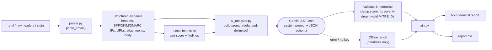

# AI-Assisted Phishing Email & Header Analyzer

A command-line **SOC L1 triage tool**. It parses a raw email (`.eml` or pasted headers), extracts the evidence an analyst checks first (SPF / DKIM / DMARC, sender IPs, URLs, attachments, body), and asks **Google Gemini** to produce a structured **Phishing Triage Report**: risk score, indicators, MITRE ATT&CK mapping and a 5-step response checklist.

> Built for learning, portfolio and L1 workflow acceleration. It supports analyst judgement - it does not replace it.

---

## Features

- **Robust parsing** - `.eml`, raw header text, or stdin; handles multipart, HTML-only mail, encoded headers and malformed input without crashing.
- **Authentication analysis** - SPF / DKIM / DMARC verdicts from `Authentication-Results` (with `Received-SPF` fallback).
- **IP attribution** - separates the *connecting IP* (recorded by your own MX - trustworthy) from the *originating IP* (earliest external hop - attacker-controlled).
- **IOC extraction** - URLs from HTML `href`s, form actions and plain text; attachment SHA-256 hashes; **all URLs defanged** in output.
- **Deterministic heuristics** - reply-to / return-path mismatch, display-name and brand impersonation, look-alike domains (`paypa1`), IP-literal URLs, link text vs href mismatch, shorteners, punycode, double-extension attachments, urgency language.
- **Gemini triage** - strict Tier-2-Lead system prompt + JSON schema output, validated and normalised in code.
- **Prompt-injection hardening** - the email is treated as untrusted data and cannot close the evidence delimiter.
- **Graceful fallback** - no key / API down / `--no-ai` -> the same report format from local heuristics.
- **Two outputs** - coloured terminal report (`rich`) + `report.md` for the ticket.

---

## Architecture Flow



| Module | Role |
|---|---|
| `parser.py` | Offline parsing + IOC extraction + explainable heuristics. No network calls. |
| `ai_analyzer.py` | Prompt construction, Gemini call (retry/back-off), schema validation, offline fallback. |
| `main.py` | CLI, terminal rendering, Markdown report generation. |

---

## Project Structure

```
ai-phishing-analyzer/
├── main.py              # CLI entry point
├── parser.py            # Email parsing + heuristics
├── ai_analyzer.py       # Gemini integration + fallback
├── sample_phish.eml     # Safe, fictional phishing sample (.example domains, RFC 5737 IPs)
├── requirements.txt
├── .env.example         # Copy to .env and add your key
├── .gitignore           # Keeps .env and generated reports out of Git
└── tests/
    └── test_analyzer.py # 21 offline tests (Gemini mocked)
```

---

## Prerequisites

- Python **3.10+**
- A Gemini API key from [Google AI Studio](https://aistudio.google.com/apikey)
- Internet access to `generativelanguage.googleapis.com` (only for AI mode; `--no-ai` works fully offline)

---

## Installation Guide

```bash
# 1. Clone
git clone https://github.com/<your-username>/ai-phishing-analyzer.git
cd ai-phishing-analyzer

# 2. Virtual environment
python -m venv .venv
source .venv/bin/activate          # Windows: .venv\Scripts\activate

# 3. Dependencies
pip install -r requirements.txt

# 4. API key
cp .env.example .env               # Windows: copy .env.example .env
# edit .env  ->  GEMINI_API_KEY=your_real_key
```

> **Never commit `.env`.** It is already in `.gitignore`.

Optional environment variables: `GEMINI_MODEL` (default `gemini-2.5-flash`).

---

## Usage

```bash
# Analyse the bundled sample
python main.py sample_phish.eml

# Custom report name
python main.py suspicious.eml -o case_1042.md

# Raw header text saved in a file
python main.py headers.txt

# Pipe from stdin
cat headers.txt | python main.py -

# Inline text
python main.py --text "$(cat headers.txt)"

# Offline mode (no API call, heuristics only)
python main.py sample_phish.eml --no-ai

# Different model
python main.py sample_phish.eml --model gemini-2.5-pro
```

**How to get raw headers to analyse:** Gmail -> ⋮ -> *Show original* · Outlook -> *File > Properties > Internet headers* · Best of all, export the message as `.eml` so URLs and attachments are analysed too.

Exit codes: `0` success · `1` input/output error · `130` interrupted.

---

## Sample Input

`sample_phish.eml` (fictional; all domains use the reserved `.example` TLD and IPs are RFC 5737 documentation addresses):

```text
Received: from mail-relay.paypa1-support.example (... [203.0.113.45]) by mx.corp-example.com ...
Authentication-Results: mx.corp-example.com;
    spf=fail ... smtp.mailfrom=service@paypa1-support.example;
    dkim=none (message not signed);
    dmarc=fail (p=NONE sp=NONE dis=NONE) header.from=paypa1-support.example
Received: from localhost (unknown [198.51.100.23]) by mail-relay.paypa1-support.example ...
Return-Path: <bounce-8841@mailer.paypa1-support.example>
From: "PayPal Security Team" <service@paypa1-support.example>
Reply-To: "PayPal Support" <recovery.desk@secure-mail-helpdesk.example>
Subject: URGENT: Your PayPal account has been limited - verify within 24 hours
Message-ID: <20260928091420.7f3c@vps-4471.bulkhost.example>
X-Mailer: PHPMailer 5.2.1

Body: urgency + "verify your identity immediately", link text showing paypal.com but
href -> paypa1-support.example, second link to a bare IP, and a "Security_Notice.pdf.html" attachment.
```

## Sample Output

### Offline mode (`--no-ai`) - real output from this repo

```text
╭─────────────────── L1 SOC Phishing Triage Report ───────────────────╮
│ PHISHING RISK SCORE  100/100   Severity: CRITICAL                   │
╰──────────────── sample_phish.eml | mode: offline ───────────────────╯
 Originating IP  198.51.100.23      Connecting IP  203.0.113.45
 SPF: FAIL     DKIM: NONE     DMARC: FAIL

 Key Suspicious Indicators (12 rules matched)
  1  Authentication Failure  SPF hard-fail: sending IP not authorised
  4  Spoofing                Reply-To domain differs from From domain
  6  Spoofing                Sender presents as 'paypal' but domain is not PayPal's
  7  Malicious URL           URL points to a bare IP address
  8  Malicious URL           Link text shows one destination, href goes to another
 11  Malicious Attachment    Double extension: Security_Notice.pdf.html
  ...
 Extracted IOCs
  URL   hxxp://paypa1-support[.]example/secure/login?session=8f2a91c4
  URL   hxxp://198[.]51[.]100[.]77/verify/index[.]php?id=88412
  FILE  Security_Notice.pdf.html  sha256=20d7d491ec6a1e2a2be4c4dc49fce17521757fd2250d326eda65d7e4ccfb4723

 MITRE ATT&CK: T1566.001 · T1566.002 · T1656
```

### AI mode - illustrative

> Gemini's wording varies run to run. The structure below is guaranteed by the JSON schema and the validation in `ai_analyzer.py`.

```json
{
  "risk_score": 97,
  "severity": "Critical",
  "score_rationale": "SPF/DMARC fail with a look-alike PayPal domain, a credential-harvest link whose text hides the real host, and a double-extension HTML attachment.",
  "suspicious_indicators": [
    {"category": "Spoofing", "indicator": "Sender domain is a look-alike of paypal.com (digit '1' replaces 'l')", "evidence": "service@paypa1-support[.]example"},
    {"category": "Malicious URL", "indicator": "Anchor text shows paypal.com but href goes to a different host", "evidence": "hxxp://paypa1-support[.]example/secure/login?session=8f2a91c4"}
  ],
  "mitre_mapping": [
    {"technique_id": "T1566.002", "technique_name": "Phishing: Spearphishing Link", "justification": "Credential-harvest link in body."},
    {"technique_id": "T1566.001", "technique_name": "Phishing: Spearphishing Attachment", "justification": "HTML attachment redirects to the phishing host."}
  ],
  "analyst_checklist": ["Preserve the .eml ...", "Search the gateway for paypa1-support[.]example ...", "Block ...", "Identify recipients who clicked ...", "Escalate to L2/IR if ..."]
}
```

The generated `report.md` contains: score & rationale -> indicators table -> MITRE table -> checklist (`- [ ]` items) -> appendix with headers, auth results, IPs, defanged URLs, attachment hashes and the heuristic rule hits.

---

## AI Prompt & Design Decisions

- **Role prompting** - "Tier-2 Lead SOC Analyst" with an explicit analysis method (auth -> identity -> infrastructure -> URLs -> attachments -> content).
- **Scoring rubric in the prompt** (0-24 Low, 25-49 Medium, 50-74 High, 75-100 Critical) *and* enforced in code - the model's severity label is never trusted.
- **Structured output** - `response_schema` (Pydantic) + `application/json`, then re-validated. Invalid MITRE IDs are dropped; checklist trimmed to 5 steps and numbering stripped.
- **Anti-hallucination** - "use only supplied evidence", explicit handling of missing data.
- **Prompt-injection defence** - email content is JSON-encoded inside `<email_evidence>` tags, `</` is escaped so the body cannot break out, and the prompt tells the model that instructions inside the email are themselves an indicator.
- **Safety by default** - URLs defanged before they ever reach the model or the report; the tool never fetches a URL or opens an attachment.
- **Low temperature (0.2)** for repeatable triage; retries with back-off on 429/5xx.

---

## Testing

```bash
pip install pytest
pytest -q          # 21 tests, no API key or network required (Gemini is mocked)
```

---

## Limitations (be upfront in interviews)

- No live threat-intel enrichment (VirusTotal, URLScan, AbuseIPDB) - IOCs are extracted and defanged for you to look up.
- The originating IP comes from `Received` headers, which the sender can forge below your trust boundary. The *connecting IP* (added by your MX) is the reliable one.
- Auth results are read from the `Authentication-Results` header stamped by *your* server. Headers pasted from an unrelated mailbox may lack them.
- Brand/look-alike detection uses a small built-in brand list and simple character normalisation - it can false-positive (e.g. `pineapple.com`) and miss unlisted brands.
- Attached `message/rfc822` emails are flattened: their body is analysed, their own headers are not.
- The tool does not decode QR codes, inspect PDF/Office contents or detonate files. Use a sandbox for that.
- LLM output can be wrong. Treat it as a second opinion and verify before containment actions.

## Roadmap

VirusTotal / URLScan enrichment · DNS lookups for SPF/DMARC records · QR-code and PDF-link extraction · batch mode for a mailbox folder · JSON/STIX export · Slack / TheHive ticket push.

---

## Interview Presentation Pitch

### 30-second version
"I built a Python tool that automates the first five minutes of phishing triage. It parses an `.eml`, extracts SPF/DKIM/DMARC, sender IPs, URLs and attachments, runs deterministic checks, and then has Gemini produce a scored triage report with MITRE ATT&CK mapping and a tailored 5-step response checklist. It is modular, tested offline, defangs every IOC, and falls back to local heuristics if the AI is unavailable."

### 2-minute walkthrough
1. **Problem** - L1 analysts repeat the same manual steps on every phishing ticket: read headers, check auth results, spot spoofing, extract IOCs, write notes. It is slow and inconsistent.
2. **Design** - three modules with clear boundaries: `parser.py` (facts, offline), `ai_analyzer.py` (reasoning), `main.py` (UX/reporting). Deterministic rules run first so the AI gets verified facts, and the tool still works without it.
3. **Security thinking** - email is attacker-controlled input, so I treated it as untrusted: injection-safe prompt delimiting, defanged URLs, no URL fetching, schema-validated output, and code-enforced severity so the model can't downgrade a bad email.
4. **Demo** - run `python main.py sample_phish.eml`: point out SPF/DMARC fail, look-alike `paypa1` domain, display-text vs href mismatch, IP-literal link, `.pdf.html` attachment, then the MITRE mapping (T1566.001/.002, T1656) and the checklist.
5. **Trade-offs & next steps** - no threat-intel enrichment yet; LLM output needs analyst validation; next I'd add VirusTotal/URLScan lookups and batch mode.

### Likely questions - short answers
- **Why not let the LLM do everything?** Rules are deterministic, explainable and free; the LLM adds contextual judgement and writes the report. Together they are more reliable than either alone.
- **How do you handle hallucinations?** Evidence-only prompt, JSON schema, MITRE ID regex validation, severity derived in code, and analyst review is mandatory.
- **What if the email tries to manipulate the model?** It is JSON-encoded inside a delimiter it can't close, the prompt names injection attempts as an indicator, and output is schema-validated.
- **Originating vs connecting IP?** Connecting IP is written by my own MX so I trust it; earlier `Received` lines can be forged by the sender.
- **Why can SPF fail on legitimate mail?** Forwarding and mailing lists - so the tool weighs auth results together with identity, URL and content evidence instead of in isolation.
- **How would you productionise it?** Queue-driven service on the abuse mailbox, TI enrichment, case-management integration (TheHive/ServiceNow), logging, and metrics on analyst agreement with the verdicts.

---

## Disclaimer

Sample data is fictional and safe (reserved `.example` domains, documentation IP ranges, harmless HTML attachment). Do not use this tool as the sole basis for security decisions. Use it only on mail you are authorised to analyse.
